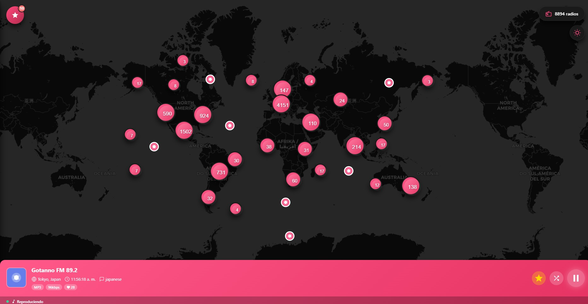

# 🌍📻 Radish Open Radio

> Explorá y escuchá radios de todo el mundo con un mapa interactivo y una interfaz moderna con paleta Radish

[](https://garbi-collector.github.io/RadishOpenRadio/)
[](https://github.com/Garbi-Collector/RadishOpenRadio)
[](https://angular.io/)
[](https://www.typescriptlang.org/)

---

## 🎯 ¿Qué es Radish Open Radio?

**Radish Open Radio** es una aplicación web que te permite descubrir y escuchar más de **5,000 radios online** de todo el mundo mediante un **mapa interactivo en tiempo real**. Cada punto en el mapa representa una estación de radio real, permitiéndote explorar por país, región o simplemente por curiosidad.

Con una interfaz moderna diseñada con la paleta **Radish** (rosa/fucsia vibrante), la app ofrece una experiencia visual única con **soporte completo para modo claro y oscuro**.

### ✨ Demo en Vivo
🔗 **[Probá Radish Open Radio](https://garbi-collector.github.io/RadishOpenRadio/)**

---

## 📸 Preview

### Modo Claro


### Modo Oscuro


---

## ✨ Características Principales

### 🗺️ Exploración
- **Mapa global interactivo** con clustering inteligente de radios
- **5,000+ estaciones** cargadas de forma optimizada (top radios más votadas)
- **Geolocalización precisa** de cada radio en el mapa
- **Zoom y navegación** fluida por todo el mundo
- **Modo oscuro para el mapa** con tiles CartoDB Dark

### 🎧 Reproducción
- **Reproductor integrado** con controles completos (play/pause)
- **Información detallada** de cada estación (país, idioma, bitrate, codec)
- **Cambio instantáneo** entre radios sin recargas
- **Radio aleatoria** para descubrir nuevas estaciones
- **Manejo de errores** con reintentos automáticos

### ❤️ Favoritos
- **Sistema de favoritos** persistente en localStorage
- **Sidebar deslizable** con todas tus radios guardadas
- **Exportar/Importar** tu lista de favoritos en formato JSON
- **Indicador visual** de la radio que está sonando
- **Organización** por nombre, país y metadatos

### 🎨 Diseño
- **Paleta Radish** personalizada (12 tonos de rosa/fucsia)
- **Tema claro y oscuro** con cambio suave (0.3s transitions)
- **Interfaz responsive** optimizada para desktop y móvil
- **Variables CSS** para fácil personalización
- **Componentes modulares** con Angular standalone components

### 🚀 Rendimiento
- **Carga optimizada** con estrategia lightweight (solo datos necesarios)
- **Cache inteligente** de estaciones ya cargadas
- **Lazy loading** de detalles bajo demanda
- **Clustering de marcadores** para mejor performance
- **Service Workers** ready (PWA compatible)

---

## 🛠️ Tech Stack

### Frontend Framework
- **Angular 18+** - Framework principal
- **TypeScript** - Tipado estático
- **RxJS** - Programación reactiva
- **Standalone Components** - Arquitectura moderna sin NgModules

### Mapas & Geolocalización
- **Leaflet.js** - Librería de mapas interactivos
- **Leaflet.markercluster** - Clustering de marcadores
- **OpenStreetMap** - Tiles para modo claro
- **CartoDB Dark** - Tiles para modo oscuro

### API & Datos
- **Radio Browser API** - Base de datos pública de radios ([de1.api.radio-browser.info](https://de1.api.radio-browser.info))
- **HttpClient** - Servicio HTTP de Angular
- **Observable Patterns** - Manejo reactivo de datos

### Estilos & UI
- **CSS Variables** - Sistema de temas dinámico
- **Custom Design System** - Paleta Radish completa
- **Responsive Design** - Mobile-first approach

### Storage & Estado
- **localStorage** - Persistencia de favoritos y tema
- **BehaviorSubject** - Estado global reactivo
- **Services Pattern** - Gestión centralizada de datos

---

## 📡 API Utilizada

Este proyecto consume la **Radio Browser API**, una base de datos comunitaria y open source con información de radios de todo el mundo.

```
Base URL: https://de1.api.radio-browser.info
```

### Endpoints principales:
- `GET /json/stations/topvote/{limit}` - Top radios más votadas
- `GET /json/stations/byuuid/{uuid}` - Detalles de una radio
- `GET /json/url/{uuid}` - Registrar click y obtener stream URL

### Datos obtenidos:
- 📻 Nombre de la estación
- 🌍 País y ubicación (lat/lng)
- 🗣️ Idioma y tags
- 🎵 Codec y bitrate
- 🖼️ Favicon/logo
- ❤️ Votos de la comunidad

**Documentación completa:** [radio-browser.info](https://www.radio-browser.info/)

---

## 🚀 Instalación y Uso Local

### Requisitos Previos
- **Node.js** >= 18.x
- **npm** >= 9.x
- **Angular CLI** >= 17.x

### 1️⃣ Clonar el repositorio
```bash
git clone https://github.com/Garbi-Collector/RadishOpenRadio.git
cd RadishOpenRadio
```

### 2️⃣ Instalar dependencias
```bash
npm install
```

### 3️⃣ Ejecutar en desarrollo
```bash
ng serve
```

Abrí tu navegador en `http://localhost:4200` 🎉

### 4️⃣ Build para producción
```bash
ng build --configuration production
```

Los archivos compilados estarán en `dist/`

---

## 📁 Estructura del Proyecto

```
RadishOpenRadio/
├── src/
│   ├── app/
│   │   ├── components/           # Componentes de UI
│   │   │   ├── map/              # Mapa interactivo
│   │   │   ├── radio-player/     # Reproductor de radio
│   │   │   └── favorites-sidebar/ # Sidebar de favoritos
│   │   ├── services/             # Servicios de negocio
│   │   │   ├── radio-browser.service.ts
│   │   │   └── theme.service.ts
│   │   ├── models/               # Interfaces TypeScript
│   │   │   └── radio-browser.model.ts
│   │   └── app.component         # Componente raíz
│   ├── assets/                   # Recursos estáticos
│   ├── theme.css                 # Sistema de temas Radish
│   └── styles.css                # Estilos globales
├── angular.json                  # Configuración Angular
├── package.json                  # Dependencias
└── README.md                     # Este archivo
```

---

## 🎨 Sistema de Temas Radish

### Paleta de Colores

#### Light Mode
```scss
--radish-1: #FF6B9D;  // Rosa suave
--radish-2: #FF5A8F;
--radish-3: #FF4981;
--radish-4: #FF3873;
--radish-5: #FF2765;  // Color primario
--radish-6: #FF1657;  // Acento
...
--radish-12: #660A69; // Rosa oscuro
```

#### Dark Mode
```scss
--radish-1: #FF8CB4;  // Rosa brillante
--radish-2: #FF7BA6;
--radish-3: #FF6A98;
...
--radish-12: #661F2C; // Rosa profundo
```

### Variables Principales
```css
--primary: var(--radish-5);
--background-primary: #FFFFFF / #0F0F0F;
--text-primary: #1A1A1A / #FFFFFF;
--gradient-primary: linear-gradient(...);
```

**Ver `theme.css` para la paleta completa**

---

## 🧠 Arquitectura y Patrones

### Services Pattern
- `RadioBrowserService` - Comunicación con la API
- `FavoritesService` - Gestión de favoritos
- `ThemeService` - Control de temas

### Component Communication
- `@Output() EventEmitter` - Emisión de eventos
- `BehaviorSubject` - Estado reactivo compartido
- `@ViewChild` - Referencias a componentes hijos

### State Management
- **Favoritos:** localStorage + BehaviorSubject
- **Tema:** localStorage + Observable
- **Radio actual:** Property binding

### Performance Optimization
- Lightweight loading (solo datos esenciales)
- On-demand full data loading
- Marker clustering
- Change detection: OnPush (donde aplica)

---

## 🌟 Roadmap y Mejoras Futuras

### 🧠 Estado del Proyecto

Radish Open Radio es una aplicación **funcional y completa**.  
Actualmente cumple con todos los objetivos planteados inicialmente y se encuentra en un estado estable.

Las siguientes secciones representan **ideas y posibles mejoras futuras**, no compromisos.
Algunas pueden implementarse en el futuro y otras pueden no llegar a realizarse,
ya que el proyecto ya cumple su propósito y el autor se siente conforme con su estado actual.


### 🔜 Próximas Features
- [ ] 📱 **PWA completa** con instalación y offline mode

### 💡 Ideas a Explorar
- [ ] 🎙️ **Historial** de radios escuchadas
- [x] 🔗 **Compartir** radios favoritas por link
- [ ] 🎨 **Temas personalizados** por el usuario

---

## 🤝 Contribuciones

¡Las contribuciones son bienvenidas! Si querés mejorar Radish Open Radio:

1. **Fork** el proyecto
2. Creá una **branch** para tu feature (`git checkout -b feature/AmazingFeature`)
3. **Commit** tus cambios (`git commit -m 'Add some AmazingFeature'`)
4. **Push** a la branch (`git push origin feature/AmazingFeature`)
5. Abrí un **Pull Request**

### 🐛 Reportar Bugs
Si encontrás un bug, por favor abrí un [issue](https://github.com/Garbi-Collector/RadishOpenRadio/issues) con:
- Descripción del problema
- Pasos para reproducirlo
- Screenshots (si aplica)
- Navegador y versión

---

## 📄 Licencia

Este proyecto está bajo la **Licencia MIT** - mirá el archivo [LICENSE](LICENSE) para más detalles.

```
MIT License

Copyright (c) 2025 Gabriel

Permission is hereby granted, free of charge, to any person obtaining a copy
of this software and associated documentation files (the "Software"), to deal
in the Software without restriction...
```

---

## 👤 Autor

**Gabriel (Garbi Collector)**  
Junior Software Developer | Argentina 🇦🇷

- 💼 [Linkedin](https://www.linkedin.com/in/victor-gabriel-castillo-scipioni)
- 🐙 [GitHub](https://github.com/Garbi-Collector)

---

## 🙏 Agradecimientos

- **Radio Browser** - Por la increíble API pública y gratuita
- **OpenStreetMap** - Por los tiles del mapa
- **CartoDB** - Por los tiles oscuros
- **Leaflet.js** - Por la librería de mapas

---

## ⭐ ¿Te gustó el proyecto?

Si encontraste útil **Radish Open Radio**, considerá darle una ⭐ en GitHub. ¡Ayuda mucho!

[](https://github.com/Garbi-Collector/RadishOpenRadio)

---

<div align="center">

**Hecho con ❤️ y mucho ☕ por Gabriel**

[🎧 Probá la Demo](https://garbi-collector.github.io/RadishOpenRadio/) · [📝 Reportar Bug](https://github.com/Garbi-Collector/RadishOpenRadio/issues) · [✨ Solicitar Feature](https://github.com/Garbi-Collector/RadishOpenRadio/issues)

</div>
